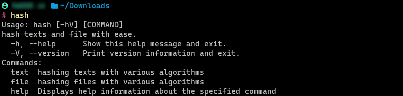
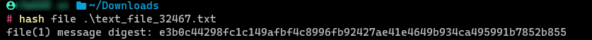
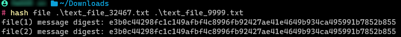

# Hashing Functions through CLI

> built using picocli

  

## Contents
- [Introduction](#introduction)
- [Features](#features)
- [Installation](#installation) 
- [Example](#example) 
- [Motivation](#motivation)

## Introduction

I wanted in this project to build a utility that is handy, if you wanted a hash for a text or file or even multiple files, all you going to do is open
the terminal or command prompt and type few commands and provide necessary arguments and that is it, you are one press away from your message digest. 

## Features

with this handy tool you can hash text, a file or multiple files with various hashing functions
with ease.

supported hashing functions are the following:
- **SHA-1**
- **SHA-256**
- **SHA-384**
- **SHA-512**
- **SHA-512/224**
- **SHA-512/256**
- **SHA3-224**
- **SHA3-256**
- **SHA3-384**
- **SHA3-512**

## Installation

### windows:

*prerequisites*
    
the only prerequisite is having installation of JDK 17 or higher.

the command called: `hash`

steps for installing:
1. go to `Releases` and scroll down to the `Assets` section
2. download `cli-hashed.zip`
3. unzip `cli-hashed.zip` folder, cd to cli-hashed folder, you will find 2 folders `bin` and `repo` and 1 text file called `hashing_functions.txt` 
4. create a system environment variable(not user environment variable) called `HASHING_FUNCTIONS` containing the absolute path to `hashing_functions.txt`
5. after setting the system environment variable you can execute the `hash.bat` from the same directory of the launcher scripts i.e. `hash.bat`

**NOTES**
- to be able to call `hash.bat` from any directory, you need to add it into your `PATH` system or user environment variables.
- it is not mandatory to call `hash.bat` with extension you can call it like this `hash`
- type `hash` in your command-line and press Enter for help 
- in `repo` there you will find the dependencies for the program
- in `bin` you will find the launcher scripts `hash.bat` and `hash-linux` for windows and linux respectively
- the directory of launcher scripts is `bin`, launcher scripts are `hash.bat` and `hash-linux`

### linux:

**Installed and tested in WSL2(Windows Subsystem of Linux 2), ubuntu distribution**

*prerequisites*

the only prerequisite is having installation of JDK 17 or higher.

the command called: `hash-linux`

steps for installing JDK 17
1. `apt update && apt upgrade`
2. `apt install openjdk-17-jdk openjdk-17-jre`
3. Once installed, verify the Java version using the following command: `java -version`
4. installation folder is located at `/usr/lib/jvm/java-17-openjdk-amd64`
5. you need to create `JAVA_HOME` environment variable and export it, to do so paste this command `export JAVA_HOME="/usr/lib/jvm/java-17-openjdk-amd64"` in `.bashrc` located in `/$HOME/.bashrc`

steps for installing 

1. go to `Releases` and scroll down to the `Assets` section
2. download `cli-hashed.zip`
3. unzip `cli-hashed.zip` folder in `/$HOME/`
4. take the generated `cli-hashed` folder and place it in `/$HOME/.local/bin/`
5. as in installation of JDK 17 you need to paste this command `export HASHING_FUNCTIONS="/$HOME/.local/cli-hashed/hashing_functions.txt"` in `.bashrc` located in `/$HOME/.bashrc`
6. to be able to call the command `hash-linux` from anywhere you need to paste these two commands  `CLI_HASHED="/home/kiemkist/.local/cli-hashed"
 ` ` PATH="$PATH:$CLI_HASHED/bin"`  in `.bashrc` located in `/$HOME/.bashrc`

**NOTES**
- I recommend that you arrange the commands in `.bashrc` in a proper way so it can be easy on you if you wanted to make any changes
- type `hash-linux` in your command-line and press Enter for help
- in `repo` there you will find the dependencies for the program
- in `bin` you will find the launcher scripts `hash.bat` and `hash-linux` for windows and linux respectively
- the directory of launcher scripts is `bin`, launcher scripts are `hash.bat` and `hash-linux`

## Example

*examples pictures are taken from a run of the program on windows machine*

help message:

hashing text:

hashing file:

hashing multiple files:

## Motivation

It was such a great experience, I Learned a lot, dealing only with the command-line, it exposed me to different perspectives in Windows and Linux command prompt and bash shell.

I used `picocli` to build this TUI app, it was seamless and pleasant experience, documentation of `picocli` was clear and there was a lot of supportive examples.

